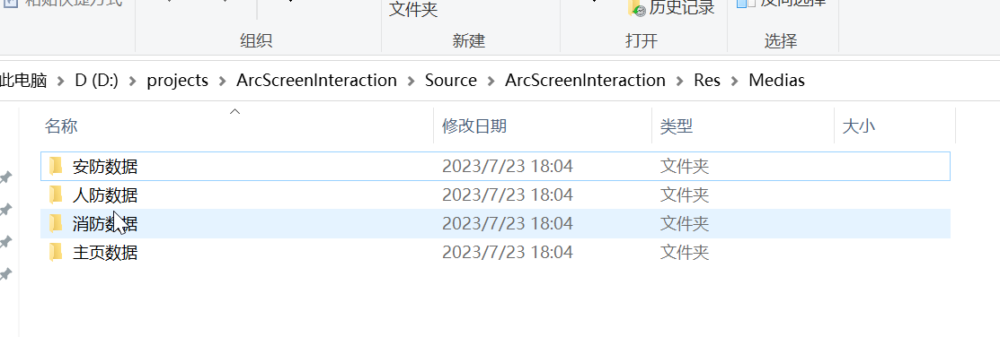
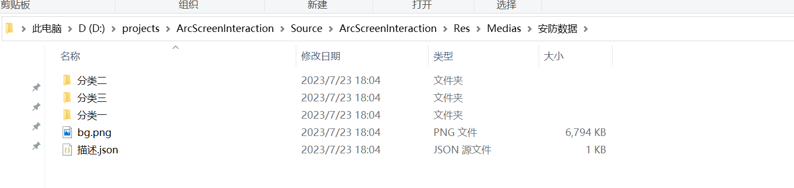
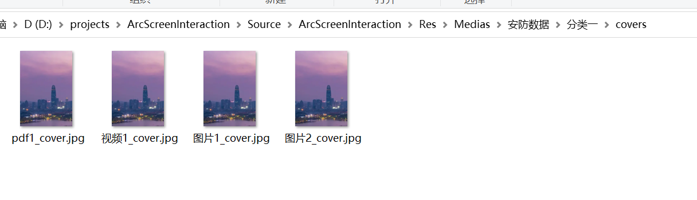

# ArcScreenInteraction 弧幕互动软件
## 相关文档
### [弧幕互动软件](https://yanmeego.feishu.cn/docx/FDmNdLgv1oTWTPxKliicOgj8nLf)
### [弧幕互动软件需求确认书](https://yanmeego.feishu.cn/docx/LJXmdpfNForvC3xVA4kcvqY7nwd)
### [项目工作安排](https://yanmeego.feishu.cn/docx/L8hOdIZHyo6xjAxdlXUcL63lnkf)
### [数据结构设计文档](https://rs9n2c1ula.feishu.cn/docx/Owa3d2X41oiQhgxxW8PcxMtanu9)

## 开发工具
### Unity2021.3.18
### Visual Studio Code 1.79.2
## 辅助工具
### Copolit v1.92.177
### [POE](https://poe.com/ChatGPT)

## 开发插件
### PDF Renderer 5.3.1
### AVProVideo 2.5.3
  
  

#
  
## 文件夹说明
### Res/ 媒体文件夹
#### Res/anfang/ 安防媒体文件夹
#### Res/renfang/ 人防媒体文件夹
#### Res/xiaofang/ 消防媒体文件夹

#### Res/anfang/分类一/ 安防的分类文件夹 里面放置对应的媒体文件

对应界面中的筛选按钮

### 缩略图文件夹

#### 缩略图文件夹中的文件名必须与媒体文件夹中的文件名一致,且后缀名还要加上_cover.jpg 当没有缩略图时，会使用默认的缩略图

## 媒体格式支持
视频：mp4  
图片：jpg,png  
PDF：pdf  
#

### 自动播放说明：
五秒鼠标无操作后，隐藏操作界面，切换到自动播放模式  
同时循环/单次播放模式、 图片和pdf的翻页间隔、切换媒体的间隔也可以在设置界面中设置  

